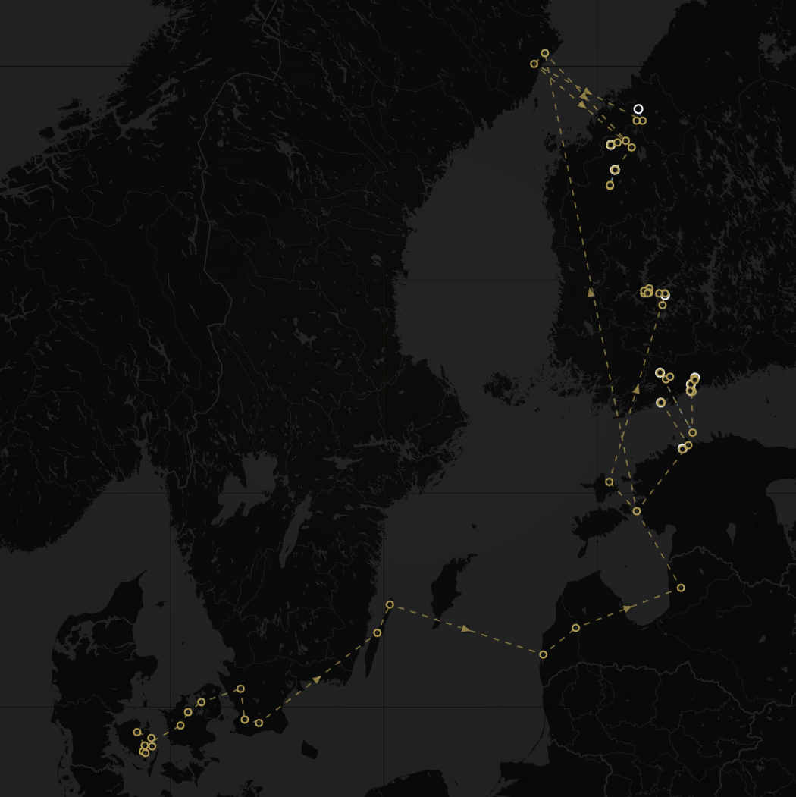
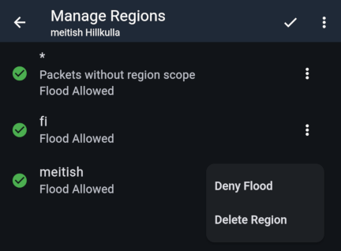

import DocLink from '@components/DocLink.astro';

Aluerajaukset (Region Scopes) ovat toistimiin tehtäviä määrityksiä, joilla rajataan toistettavia viestejä.

LoRa-radioviestintä kantaa nimensä mukaisesti pitkiä matkoja. Maiden rajat eivät viestejä pysäytä. Silloin tällöin ilmakehän ominaisuudet muodostuvat sellaisiksi, että viestit kulkevat erityisen pitkiä matkoja. Ilmiö tunnetaan termillä *tropospheric ducting*, puheissa tämä lyhentyy tyypillisesti *tropoksi*. Kuvassa yhden paketin Itämeren risteily.

MeshCoren käyttäjille tämä näkyy niin, että ulkomailla sijaitsevien toistinten mainokset kantavat Suomeen asti, ja kuultujen toistinten listalle ilmestyy runsain mitoin uusia tuttavuuksia. Public-kanavalle ilmestyy niinikään vieraskielisiä viestejä. Ulkomailla meshien kartoitusta tekevien MeshMapper-käyttäjien tiheät wardriving-lähetteet kantavat niinikään Suomeen asti.

Ilmiö on sinällään harrastajan näkökulmasta kiehtova, mutta siinä on varjopuolensa. Toistinten ylläpitäjille vakavin näistä on se, että viestit kuluttavat omien toistinten sallittua radioaikaa (eurooppalainen 10 % *duty cycle*-rajoitus) ja toistimen akkuvirtaa. Rivikäyttäjälle myös kanavien ja toistinlistan täyttyminen saattaa olla ärsyttävää.

**Varautumisnäkökulmasta** koko ilmiö on haitallinen – kriisiaikana voidaan olettaa mesh-viestinnän volyymin kasvavan kaikkialla, ja paikallisen viestinnän jääminen ulkomaisen viestinnän jalkoihin vie pohjan meshin käytöltä silloin, kun sille on eniten tilausta.

## MeshCoren aluerajausten perusteet

Edellä mainittuihin ongelmiin tartuttiin MeshCoren toistinkoodissa version 1.10 kohdalla marraskuussa 2025. Tänä päivänä ominaisuus on kypsä ja käytössä laajalti.

Toistimen asetuksissa on lista toistettavista aluerajauksista. Ensimmäisenä listassa on asteriskilla (*) merkitty alue, jonka alla on selite 'Packets without region scope'. Jatkona on itse määritellyt alueet.

Asteriski-alue **ei ole jokerimerkki** (wildcard)! Se tarkoittaa selitteen mukaisesti paketteja, joilla ei ole aluerajausta. Ne ovat protokollatasolla erilaisia paketteja kuin aluerajauksen sisältävät paketit – eräänlaisia 'legacy'-paketteja. MeshCoren aluerajaukset eivät siis tue jokerimerkkejä! Jokainen toistettava alue täytyy nimetä erikseen.

Tarpeettoman kauas vuotavat viestit ovat poikkeuksetta asteriski-merkillä tarkoitettuja 'legacy'-paketteja. Naapureille vuotavien pakettien ongelma ratkeaa jo lähtöpisteessä, kun meshissä otetaan käyttöön oma kansallinen aluerajaus. Tarvittaessa jokainen toistimen ylläpitäjä voi kuitenkin kieltää toistimellaan näiden pakettien toiston. Oletusasetus on, että toisto sallitaan.

Asetuksissa aluerajauksille voidaan määritellä, toistetaanko niitä (Flood allowed). Kuvan toistimen asetuksissa on määritetty Suomen MeshCoren suositusten mukaisesti aluerajaus **fi**. Toistin toistaa siis viestit, jotka **käyttäjät lähettävät fi-regionilla**. Käyttäjien kumppaniradiot on Suomen MeshCoressa ohjeistettu käyttämään oletusarvoisesti fi-regionia. Myös paikallinen aluerajaus **meitish** on määritetty toistettavaksi; tässä meshissä lähetetään ilmoituksia paikkakunnan tapahtumista yhteisesti sovitulla paikallisella aluerajauksella.

Kuvan toistin toistaa myös aluerajauksettomia paketteja; asteriskilla merkityn alueen osalta toistot on sallittu ('Flood allowed'). Valinta 'Deny flood' kieltää toistot.

:::tip[Teknisesti...]{icon="seti:json"}
...aluerajattu viesti hashataan aluerajauksen nimellä. Jokainen toistimeen määritetty alue tarkoittaa yhtä hashin sovitusta lisää. Nämä suoritetaan määritysjärjestyksessä, joten järjestyksellä on merkitystä suorituskyvyn kannalta.
:::

