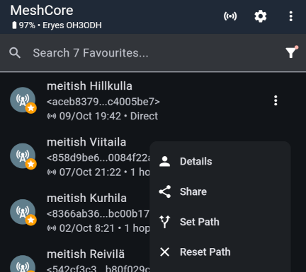
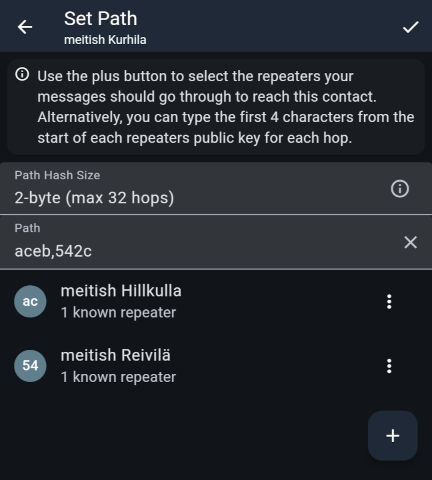

import DocLink from '@components/DocLink.astro';
import { Tabs, TabItem } from '@astrojs/starlight/components';

Suomen MeshCoressa käytettävät asetukset on pitkälle vakioitu. Tältä sivulta löydät näppärän rimpsun, jonka copy-pasteaminen toistimen komentoriville määrittää asetukset kerralla. Ohjeistettuna on myös asetusten teko käyttöliittymän kautta, mutta tällä tavalla kaikkia asetuksia ei voida määrittää. Komentorivin kautta komentaminen on näinollen suositeltava tapa.

Komentoriviin pääset käsiksi
* Selaimessa MeshCore Flasherin etusivulta löytyvällä **Repeater Setup** -työkalulla, kun toistin on kytkettynä tietokoneeseen USB-kaapelilla, vaikka heti flashäyksen jälkeen
* Virallisen sovelluksen kautta radioteitse, myös meshin yli
* Tietokoneella käyttämällä **meshcore-cli** -työkalua. Tällä tavoin onnistuu vaikka sarjatyönä tehtävä toistinten konfigurointi – asetukset jiiriin useampaan laitteeseen kerralla.

Graafisen käyttöliittymän kautta asetukset voi tehdä näistä kahdella ensimmäisellä: Repeater Setupilla kaapelin yli ja virallisella sovelluksella radion yli.

## Muokkausta ja pohdintaa seuraaviin

Nämä voi määritellä sekä käyttöliittymässä että komentorivillä:
* Toistimelle pitää antaa **nimi**. Useimmiten nimi viittaa paikkaan, jonne toistin päätyy työtään tekemään. Nimen suhteen sinulla on vapaat kädet. Huomaa, että pitkä nimi tarkoittaa isompaa mainostuslähetettä. Emojit saattavat varata neljäkin tavua.
* Toistimen **sijainti** annetaan koordinaatteina.
* **Mainostuksen toistotiheys** eli Advert Interval asetetaan erikseen koko meshin alueelle välitettäviin mainoksiin (*Flood*, yksikkönä tunnit) sekä vain toistimen kantaman kattaviin suoriin mainoksiin (*Direct*, yksikkönä minuutit). Muista, että jokainen mainos on lähete, joka rasittaa akkukäyttöisen toistimen akkua, ja että jokainen flood-mainos rasittaa koko meshiä. [Lue syventävä osuus.](#mainostamisesta)
* Toistetaanko viestit, joissa **ei ole aluerajausta** tai rajoitetaanko niitä? Suomen MeshCoressa pyritään siihen, että kotimainen viestintä käyttää fi-aluerajausta. Näin maan ulkopuolelta aika-ajoin saapuvat aluerajauksettomat viestit voidaan erottaa meille tärkeimmästä paikallisesta viestinnästä. Vuotoviestit välitetään kaikille alueesi meshin käyttäjille, jos ne sallitaan, ja tämä saattaa paikoin ärsyttää. Lisäksi ne kuluttavat toistinverkon radioaikaa ja akkuja. <DocLink page="repeaters/regions">Lue syventävä osuus.</DocLink>
* Toistettavat regionit: **fi** joka tapauksessa. **offgrid**, jos toistin on sähköverkosta riippumaton – tämä määritetään ennenkaikkea mahdollistamaan offgrid-meshin toimintakyvyn testausta. Lisäksi paikallisesti sovitut [pienemmät aluerajaukset](#paikalliset-aluerajaukset). Jos toistin on paikalla, jossa se voi olla naapurimaan MeshCoren apuna (rannikot ja rajaseudut), voidaan lisätä myös naapurimaan kansallinen aluerajaus ja tehdä naapuriapua.
* Lähetyksen teho (**set tx / Transmit Power (dBm)**) täytyy asettaa ottaen huomioon **toteutuvan säteilytehon** (Effective Radiated Power, ERP) käsite. Parametrin maksimiarvo riippuu laitteen spekseistä: 21 ... 23. Suurin sallittu toteutuva säteilyteho on 500 mW. Tähän tulee kiinnittää huomiota erityisesti suuntaavia antenneja käytettäessä. <DocLink page="repeaters/devices" anchor="säteilyteho-saa-olla-korkeintaan-500-mw-erp">Lue syventävä osuus.</DocLink>

## Suomen MeshCore -asetukset

<Tabs syncKey="interface">
  <TabItem label="Komentorivikomennot">

```
set name oma_nimi
set lat oma_sijainti
set lon oma_sijainti

set radio 869.618,62.5,8,8
set tx 22
set dutycycle 10

set path.hash.mode 1
set advert.interval 0
set flood.advert.interval 30
set loop.detect moderate

region put fi
region default fi
# region put offgrid
# region put omat_lisäykset
# region put naapuri_regionit
region save

clock sync
```

  </TabItem>
  <TabItem label="Käyttöliittymällä">

| Asetus | Arvo |
|:-------|:----:|
| *Name & Location ...* | |
| ` > `  Name | (nimi) |
| ` > `  Latitude | (koordinaatti) |
| ` > `  Longitude | (koordinaatti) |
| *Access ...* | |
| ` > `  Admin password | (hallinnan salasana) |
| *Radio settings ...* | |
| ` > `  Preset | EU/UK (Narrow) |
| ` > `  Duty Cycle (%) | 10 |
| *Advertising ...* | |
| ` > `  Advert interval (minutes) | 0 |
| ` > `  Flood advert interval (hours) | 30 |
| *Regions ...* | |
| ` > `  Default region | fi |
| ` > `  Home region | fi |
| ` > `  Unscoped traffic → Allow Flood | ☑ / ☐ |
| ... + Add region | |
| ` > `  Region name | fi |
| ` > `  fi → Allow Flood | ☑ |
| ... lisää muut alueet samoin | |
| *Advanced Settings ...* | |
| ` > `  Repeat | ☑ |

  </TabItem>
</Tabs>

## Mainostamisesta

Toistimen mainostaminen ei ole välttämätöntä, jotta toistin toimisi osana meshiä. Ilman mainoksia toistimen nimi ja sijainti jäävät tuntemattomiksi, ja sen julkisesta avaimesta tulee tietoon ainoastaan kaksi ensimmäistä tavua, joka riittää täysipainoiseen reititykseen. Mainostaminen tiedottaa kuulolla oleville laitteille toistimen nimen, sijainnin ja koko julkisen avaimen.  Ylläpitäjälle se tarjoaa 'elonmerkin', tiedon siitä että toistin on hereillä.

Suomen MeshCore suosittelee, ettei toistinmainoksia lähetettäisi koko meshin laajuisesti ainakaan alle 24 tunnin välein. Mainos on yllättävän iso paketti meshissä, eikä sen toistaminen tuota meshille lisäarvoa. Radiokantaman päähän lähetettävät suorat (*direct*) mainokset ovat turhia, jos mainoksia lähtee myös koko meshin jakoon. Suositus on, että valitaan näistä ainoastaan toinen. Kulkuneuvon mukana liikkuvan toistimen tapauksessa suorat mainokset saattavat olla käyttökelpoinen vaihtoehto.

Jos haluat käyttää mainoksia elonmerkkeinä, yksi hyvä ratkaisu on määritellä mainosväliksi jotain väliltä 49 - 71 tuntia. Tällöin mainokset lähtevät aina eri vuorokaudenaikoina – mainostat myös niille, jotka olisivat tasavuorokautisen mainosaikasi aikaan muualla. Oma sovelluksesi näyttää viimeisimmän kuullun mainoksen ajankohdan; jos viimeisimmästä mainoksesta on yli kolme päivää, saattaa olla että jokin on vialla. Jos siitä on yli kuusi päivää, on syytä tarkastaa toistimen tilanne.

## Toistimen etähallinnasta meshin yli

Asennuspaikalla olevan toistimen asetusten hallinnointi onnistuu meshin yli, mutta varminta ja meshin kannalta säästeliäintä on hakeutua radiokantaman päähän laitteesta ja komentaa sitä suoralla yhteydellä.

Toistimen hallinta aloitetaan valitsemalla toistin kontaktilistalta ja painamalla *Manage*-hammasrataskuvaketta. Kirjautuminen tapahtuu salasanalla.

Meshin yli toimiessa fiksuinta on määritellä aluksi **polku** jota pitkin paketit kulkevat edestakaisesti. Jos et määrittele polkua käsin, adminointisi kulkeutuu koko meshiin ainakin ennen kuin kumppaniradio saa vastauksen ja ottaa käyttöön vastauspolun. Käsin määritelty polku on kuitenkin varmempi – ainakin, jos mesh on itsellesi niikseen tuttu, että tiedät mikä polku varmimmin toimii.

Polun voi määritellä karttanäkymässä, jos kumppaniradiossasi on sijainti asetettuna. Sen voi määritellä myös alla esitellyssä näkymässä. + -painikkeella lisätään toistimia polkuun. Voit myös itse kirjoittaa kenttään julkisen avaimen ensimmäiset tavuparit pilkuilla eroteltuna.





Lähietäisyydelle hakeutuminen hallinnointia varten paljastaa virallisen sovelluksen puutteen: yhteydenmuodostus lähettää väkisin floodattavan paketin, mutta kun toistimen vastaus tulee suorana, toiminta muuttuu suoraksi (polun kohdalla lukee *Direct*.) Tällöin voit olla varma, ettei asetusten työstö aiheuta ylimääräistä kuormaa meshille.

Etähallinnassa on käytettävissä sekä käyttöliittymä- että komentorivihallinta.

## Paikalliset aluerajaukset

Paikallisesti voidaan sopia esimerkiksi, että perustetaan oma avoin kanava (``#tre-admin``) toistinten ylläpitäjien viestintään, ja että kanavalla käytetään paikallisesti toistettavaa aluerajausta. Näin viestit eivät turhan tähden rasita koko fi-aluetta. Samaa periaatetta voi soveltaa myös muuhun paikalliseen viestintään. Kanavakohtaisen aluerajauksen asettaminen on opastettu <DocLink page="users/channels" anchor="kanavien-kaytto-meshcore-sovelluksessa">käyttäjäohjeissa</DocLink>.
