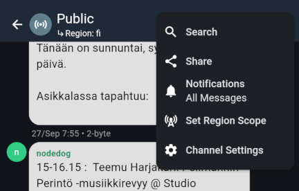
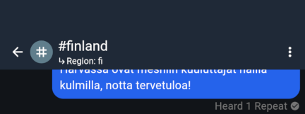
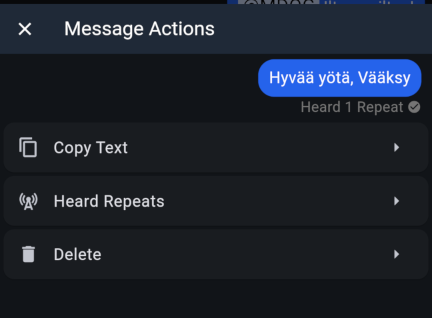
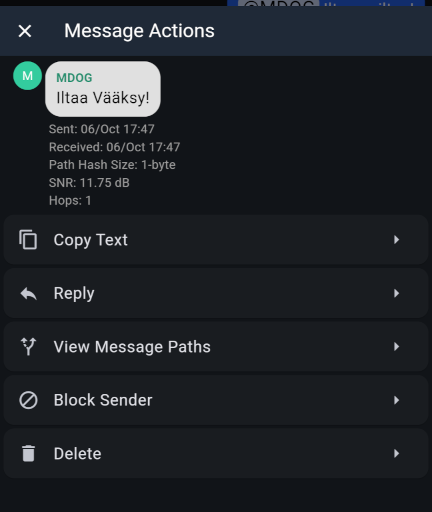

import DocLink from '@components/DocLink.astro';

MeshCoren kanavat (Channels) ovat foorumi, joilla käydään useiden käyttäjien välisiä keskusteluja. Käytännössä kumppaniradio lähettää kanavaviestisi ilmoille, ja ne välitetään aina niin laajalle alueelle, kuin toistinverkko mahdollistaa. Etenemistä rajoittaa ainoastaan **aluerajaus**, josta opittiin edellisellä sivulla, ja **toistopolun kirjanpidon tarkkuus** (Path Hash Size), joka Suomen MeshCoressa asetetaan kahden tavun mittaiseksi per toisto (2-byte). Toistopolun kirjanpito asettaa toistojen määrälle maksimiksi 32 toistoa yhtä viestiä kohden.

Kirjanpito auttaa toistimia ja kumppaniradioita pysymään kärryillä viestin kulkemisesta läpi meshin. Yksityisviesteissä ja eräissä muissa lähetteissä toistopolku luo pohjan MeshCoren oleelliselle oivallukselle: kun viesti on saatu määränpäähänsä, se sisältää tiedon reitistä, jota pitkin viesti on kulkenut. Vastaus voidaan lähettää samaa reittiä pitkin. Vastauksen välittämiseen osallistuvat ainoastaan ne toistimet, jotka todetusti muodostavat luotettavan viestinvälitysketjun lähettäjän ja vastaanottajan välillä. Syntyneestä **polusta** pidetään kiinni niin kauan, kun se toimii luotettavasti.

:::tip[Teknisesti...]{icon="seti:json"}
... toistopolun tallennukselle on viestiprotokollassa varattu tietty tila. Jos jokainen viestin toisto tallennetaan yhdellä tavulla, tila täytyy 64 toiston jälkeen; Suomen MeshCoressa tallennetaan kaksi tavua per toisto, joten tila täyttyy 32 toiston jälkeen.

Kirjattavat tavut ovat toistimien **julkisen avaimen ensimmäisiä tavuja**. Yhden tavun kirjanpidon ongelmana on, että alkaa olla todennäköistä, että matkan varrella on useampi toistin, joiden avaimen ensimmäiset tavut ovat samat – Suomen MeshCore edellyttää siksi kahden tavun kirjanpitoa, jolloin sattuman mahdollisuus on jo häviävän pieni.
:::

Kanavaviestit **eivät hyödynnä toistopolkua** yksityisviestien tavoin – ne välitetään aina koko meshin laajuisesti. On hyvä ymmärtää, että **yksityisviestit ovat kahdenväliseen viestintään** meshin kannalta parempi vaihtoehto. Kanavaviestit eivät myöskään takaa lähettäjän identiteettiä samalla kryptografisella varmuudella kuin yksityisviestit; lähettäjän nimi on kanavaviesteissä näkyvissä, mutta näkyviin se tulee ainoastaan viestin mukana lähetetyn nimen perusteella.

Kun puhelin tai tietokone ei ole yhteydessä kumppaniradioon, kaikki vastaanotetut viestit jäävät kumppaniradion muistiin. Ne puretaan sieltä aina yhteyden muodostuttua. Varsinkin pienellä muistilla varustetuissa nRF52-laitteissa tilaa ei välttämättä ole paljoa, jolloin pöytälaatikkoon unohtuva laite on äkkiä täysi.

Viimeinen kanavaviestejä koskeva opinkappale on, että kun ne on toistettu läpi meshin kertaalleen, mahdollisuus vastaanottaa ne on mennyt ohi. Kumppaniradion täytyy olla **käynnissä ja kuulosalla**, että viesti tulee näkyviin. Esimerkiksi tilanteessa, jossa poistut oman meshin alueelta kumppaniradio mukana, jää poissaollessasi käyty kanavaviestintä sinulta sivu suun. Viestit eivät ilmesty takautuvasti laitteeseen palatessasi oman meshin äärelle.

## Public-kanava, kaikkien kanavien äiti

Jokainen kumppaniradio kautta maailman seuraa Public-kanavaa. Se on MeshCoren julkisin foorumi. Publicille lähetetty viesti tulee näkyviin jokaiselle kantamalla olevan kumppaniradion käyttäjälle sekä niin pitkälle, kuin toistinverkko kantaa.

## Avoimet kanavat eli 'hashtag-kanavat'

MeshCoressa kanavat, joiden nimi alkaa # -merkillä, ovat **avoimia kanavia**. Ne toimivat samalla tavalla kuin Public-kanava – teknisesti kyse on siitä, että Publicin ja avointen kanavien salausavain on yhdessä sovittu, joten kaikki laitteet osaavat purkaa salauksen.

Kuka tahansa voi 'perustaa' avoimen kanavan yksinkertaisesti lisäämällä sellaisen oman kumppaniradionsa kanavalistaan. Kun muut lisäävät saman nimisen kanavan, viestit kanavalla tulevat kaikille näkyviin. Jekkuna on nimen alun # -merkki, joka MeshCoressa tarkoittaa, että kanava salataan samalla tavalla yhdessä sovitulla avaimella kuin Public-kanava.

## Yksityiset kanavat eli kanavat ilman 'hashtagiä'

Kun kumppaniradioon luodaan kanava ilman # -merkkiä, kumppaniradio luo kanavalle **uniikin salausavaimen**. Tämä salausavain on vain kanavan luoneen käyttäjän tiedossa. Tällaiset kanavaviestit etenevät meshissä samoin kuin edellä, mutta erona on, että salausavain ei ole yleisesti tunnettu, eikä viestejä voi lukea sitä tietämättä.

Kun yksityiskanavan piiriin halutaan lisätä käyttäjiä, täytyy heille jakaa kanavan täsmällinen nimi sekä kanavan salausavain. Tämän myötä vain avaimen saaneet henkilöt näkevät kanavan viestit. Tuonnempana kerrotaan, miten kanava jaetaan.

## Kanavien käyttö MeshCore-sovelluksessa

Viestiosuus on niikseen samankaltainen kuin tutut pikaviestisovellukset, ettemme itsestäänselvyyksiä tässä läpi käy. Viesteihin voi vastata ja käyttäjiä voi mainita nimeltä niin, että toinen osapuoli saa mainituksi tulemisesta ilmoituksen. Viestin maksimipituus on rajallinen, ja sitä verottaa myös oman nimimerkin merkkimäärä. Ääkköset vaativat tilaa kahden tavallisen aakkosmerkin verran, emojit vieläkin enemmän.

Public-kanava on aina tarjolla kanavalistassa. Käytetään sitä esimerkkinä, kun tutustumme oikean ylänurkan valikon takaa löytyviin **kanava-asetuksiin**. 

* **Search** ▹ Reaktiivinen hakutoiminto, joka rajaa näkymään vain hakulauseen sisältävät viestit.

* **Share** ▹ Avaa näytölle QR-koodin, jonka skannaamalla toinen käyttäjä saa lisättyä kanavan omaan kumppaniradioonsa. Oikeasta yläkulmasta löytyy 'Copy Link to Clipboard' -toiminto, joka antaa QR-koodin tietosisällön leikepöydälle jaettavaksi muuta kautta.

* **Notifications** ▹ Valinnat kanavasta tehtävistä ilmoituksista. Voit valita, että ilmoitus tulee vain maininnoista tai mykistää ne kokonaan.

* **Set Region Scope** ▹ Valitse aluerajaus, jota käytetään tällä kanavalla. Tästä näkymästä voit myös määrittää uuden aluerajauksen.

* **Channel Settings** ▹ Valinnat kanavasta säilytettävästä viestihistoriasta ja käyttäjien estosta, lista kanavalla vaikuttaneista nimimerkeistä ja toiminto viestihistorian tyhjennykseen.

Oleellisia näistä ovat **Share**-toiminto, joka on helpoin tapa jakaa yksityinen kanava toiselle käyttäjälle, ja **Set Region Scope**, joka tulee tarpeen, jos paikallisessa meshissäsi käytetään paikallisia aluerajauksia. Tyypillinen tilanne olisi esimerkiksi tamperelaisten toistinylläpitäjien keskinäisen yhteydenpidon #tre-admin -kanava, jonka jakelu on sivistyneesti päätetty rajoittaa vain paikalliseen meshiin, jolloin aluerajaukseksi kanavalle asetettaisiin esimerkiksi **tre**.

Muistutuksena kanavalle määrittelemästäsi aluerajauksesta näkyy pieni **Region: fi** -huomio kanavan nimen alla. Kuvassa näkyy myös itse lähetetyn viestin alla statusilmoitus **Heard 1 Repeat**. Tällä kumppaniradio kertoo, että sen lähetettyä viestin ilmoille, se kuuli yhden toistimen toiston. Kun näet, että viestisi on toistettu, voit olla kohtuullisen varma siitä, että se on lähtenyt meshin matkaan onnistuneesti. Jos toistoa ei kuulu, on täysin sallittua yrittää viestin lähetystä uudelleen paremmasta paikasta. Jos niitä kuuluu useita, Suomen MeshCorella menee hyvin 🙃

Uudelleen yrittäminen onnistuu vaikkapa pitkällä oman viestikuplan painalluksella tai oikealla hiirennapilla, jolloin voit kopioida viestin leikepöydälle ja liittää sen takaisin syöttökenttään. Toimintoja löytyy myös kuultujen toistojen erittelyyn ja viestin poistamiseen omasta laitteesta.

Vastaanotettujen viestien pitkä painallus tai oikea hiirennappi avaa samankaltaisen toimintokattauksen. Täällä mielenkiintoinen toiminto on 'View Message Paths', joka kertoo, millaista polkua tämä kanavaviesti on kumppaniradioosi päätynyt. Toiminto on käytettävissä vain, jos viesti on vastaanotettu puhelimen tai tietokoneen ollessa yhteydessä kumppaniradioon.

---

Seuraava aihe käsittelee identiteettiä MeshCoressa. Aihe pohjustaa viimeisen osion, jossa tutustumme yksityisviesteihin ja niiden myötä reitityspolkuihin.
