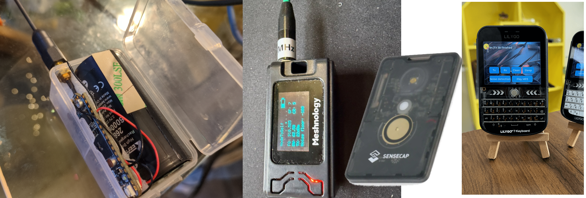
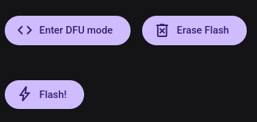
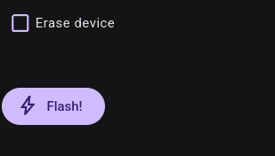
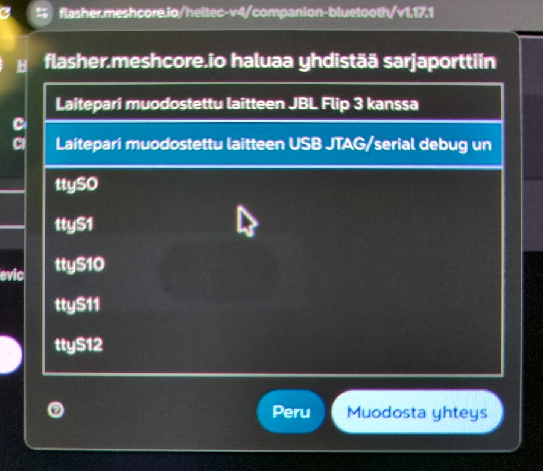

import DocLink from '@components/DocLink.astro';
import { Tabs, TabItem } from '@astrojs/starlight/components';

Ensimmäinen kurkistus mesh-laitteiden tarjontaan hautaa katsojan rönsyilevään vaihtoehtojen viidakkoon. Tämän oppaan avulla onnistut toivottavasti ensimmäisellä yrittämällä valitsemaan käyttökelpoisen ja itselle mieluisen laitteen.

Viidakkoon sukeltaessa auttaa tieto siitä, että **kaikki vaihtoehdot** jakautuvat kahteen leiriin *järjestelmäpiirin* (System-on-Chip, SOC) perusteella:

| Järjestelmäpiiri | Luonne | Valmistaja |
|:-----:|:-------|:------:|
| **ESP32** | Monipuolinen, sähkönnälkäinen, WiFi-ominaisuudet mukana. | Expressif, Kiina |
| **nRF52** | Yksinkertainen, virtapihi, ei WiFi-ominaisuuksia. | Nordic Semiconductor, Norja |

Toinen mielessä pidettävä asia on, että mikään laite ei ole kaupasta kotiutuessaan käyttövalmis MeshCore-kumppaniradio. Saatat löytää kaupasta tuotteen, johon on valmiiksi asennettu MeshCoren kumppaniradio-ohjelmisto, mutta poikkeuksetta versio on vanha, kehitys on nopeata. Tuonnempana käsiteltävä [flashäys](#ohjelmiston-asennus) on MeshCore-käyttäjän kansalaistaito, joka kannattaa ottaa heti kättelyssä haltuun.

Kolmas kinkkinen asianlaita on, ettei näille laitteille ole yhtä vakiintunutta termiä. Verkkokaupoissa seikkaillessa laitteista saatetaan käyttää montaa nimeä:

* Mesh node
* Mesh radio
* LoRa development board
* Meshtastic device
* Wireless tracker / tag
* Communication device

MeshCore Suomi ei tarjoa linkkisuosituksia ostopaikoista. Toistaiseksi laitteita ei ole Suomessa myytävänä, joten ostoksille joutuu lähtemään ulkomaisiin verkkokauppoihin.

:::tip[Malttia vielä!]{icon="warning"}
Kun mieluinen laite on löytynyt, muista varmistaa ennen ostopäätöstä, että sille on saatavilla MeshCoren kumppaniradio-ohjelmisto. Aiheeseen [päästään alempana](#ohjelmiston-asennus).
:::

## Valmis laite vai tee-se-itse?

Itse tekeminen mahdollistaa yksilöllisen ja erittäin edullisen kumppaniradion toteuttamisen. Yksinkertaisimmillaan riittää 10 ... 30 € sijoitus *development board* -tyyppiseen tuotteeseen, käyttöä kestävä kotelointiratkaisu ja virransyöttö USB-virtapankista. Käytännössä kaikki edellämainitun kaltaiset tuotteet voi kytkeä litiumiakkuun ilman lisähankintoja.

Valmiissa laitteissa on tarjontaa luottokortin kokoisista *tracker*-laitteista näppäimistöllä ja näytöllä varustettuihin laitteisiin asti. Valmiit laitteet ovat jonkin verran hintavampia, 100 ... 200 € luokkaa. Yhteisö on tehnyt varsinkin näppäimistölaitteille erinomaisia MeshCore-sovelluksia, mutta näitä täytyy haeskella muualta kuin viralliselta Flasher-sivustolta.

## Ohjelmiston asennus

:::note
Jos kumppaniradiosi tulee käyttöön mobiili- tai tietokonesovelluksen kanssa, nyt on hyvä aika valita ja asentaa sellainen. MeshCore-projektin virallinen sovellus on [Liam Cottlen MeshCore](https://meshcore.io/#download).
:::

Kumppaniradioiksi virallisesti tuetut laitteet on listattu [MeshCore Flasherissä](https://flasher.meshcore.io). Laitteesi löytyminen listalta tarkoittaa, että se on virallisesti tuettu ja siten varma valinta kumppaniradioksi. Asennus listan laitteisiin tapahtuu suoraan tällä sivustolla ja on pitkälti automaattinen. Asennus onnistuu vain tietokoneen selaimella, mobiililaitteilla selainasennusta ei voi suorittaa. Termi *flashäys* tarkoittaa tässä ohjelmiston asennusta.

:::note[Edellytykset]
* Selaimella asentaminen edellyttää Web Serial API-tuella varustetun selaimen (Chrome / Chromium, Edge, Opera ja tuoreet Firefox-selaimet).
* USB-kaapelisi täytyy olla ns. datakaapeli, ei pelkkä latauskaapeli.
* Linux-käyttäjien täytyy lisätä oma käyttäjänsä ryhmään, jonka hallinnassa USB Serial -portti on (usein *dialout* tai *uucp*) jotta flashäys onnistuisi.
* Jos ei vaan onnistu, kannattaa kokeilla vaihtaa kaapeli toiseen tai kokeilla muita tietokoneen USB-portteja.
:::

Liitä laite kaapelilla koneeseen ja valitse laitteen nimi listalta. Valitse seuraavalta listalta joko **Companion Bluetooth** tai **Companion USB** sen mukaan, haluatko käyttää laitetta langattomasti Bluetoothilla vai USB-kaapelia pitkin.

Aukeava sivu on viimeinen ennen asennuksen käynnistymistä. Sivulla voi valita asennettavan ohjelmistoversion, ja viimeisin on automaattisesti valittuna. Jos laitteesi on **nRF52**-leiristä, tarjolla on nämä toiminnot. nRF-laitteet täytyy ohjastaa DFU-tilaan ennen flashäystoimenpiteitä; valitse siis ensin 'Enter DFU mode'.

**ESP32**-laitteilla näkymä on yksinkertaisempi. Laitteesi saattaa kuitenkin edellyttää flashäystilaan siirtymisen näppäinyhdistelmällä, ennenkuin asennus voidaan aloittaa. Kannattaa kuitenkin kokeilla, josko onnistuisi ilman temppuja.

Molemmissa tapauksissa ensimmäinen ohjelmiston asennus kannattaa tehdä 'puhtaalta pöydältä', eli käyttää 'Erase flash' / 'Erase device' -toimintoa. Sensijaan jatkossa, kun päivität laitteen uusia ohjelmistoversiota, tätä ei tule käyttää, ettet menetä omia asetuksiasi.

Lopuksi painetaan 'Flash!'. Selain avaa valintaikkunan, josta valitset oman laitteesi omaa päättelykykyä hyödyntäen. 'Muodosta yhteys' vie eteenpäin, ja asennus alkaa. Muista, että asennuksen alettua sitä ei missään nimessä saa keskeyttää! Asennus kestää vain kymmenisen sekuntia.

Jos asennus onnistui – onneksi olkoon, kumppaniradiosi on valmis palvelukseen! Jos taas toimitus kompuroi, kannattaa yrittää uudelleen. ESP32-laitteen ollessa kyseessä todennäköinen syy epäonnistumiseen on, että laite täytyy komentaa flash-tilaan jollakin tavalla. Laitteen ohjeista tai Suomen MeshCoren keskusteluryhmästä löytyy varmasti apua.

## Seuraavaksi määritetään asetukset

Käyttöönotto jatkuu asetusten määrityksellä. Laitteita ja niiden kanssa käytettäviä sovelluksia on useita; näillä sivuilla viedään kädestä pitäen asetusten teko virallisen MeshCore-sovelluksen kanssa. Jos käytät muunlaista laitetta tai sovellusta, joudut soveltamaan ohjeita.

