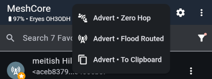
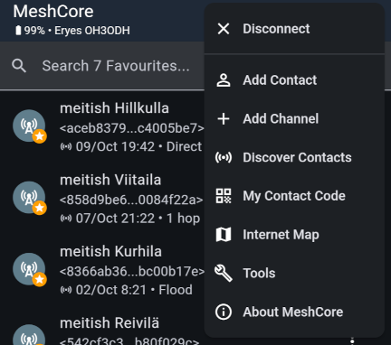
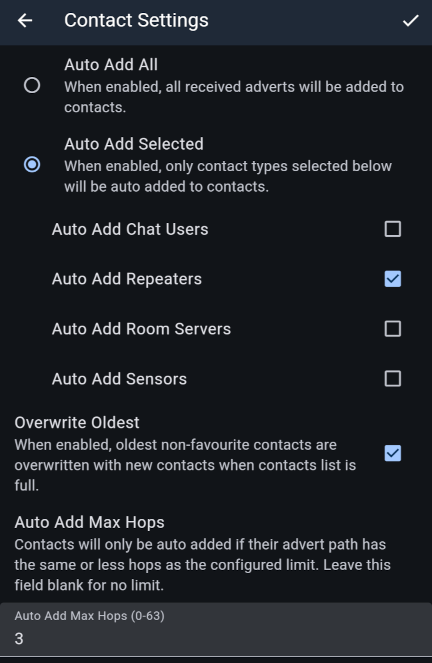

import DocLink from '@components/DocLink.astro';

Tuoreen kumppaniradion kanssa MeshCore-matkaa aloittaessa olet meshille ja sen käyttäjille täysin tuntematon. Jos seuraat kanavien keskusteluja, kukaan ei tiedä siitä.

Periaatteessa voisit myös osallistua kanavilla keskusteluun tekaistulla nimellä, sillä kanavaviestit eivät anna kirjoittajan identiteetistä muuta tietoa kuin nimimerkin, joka kanavaviestissä on vain merkkijono osana viestiä. Vaikka virallinen sovellus ei sitä salli, tekaistun nimen käyttäminen kanavilla on helppoa. Tämä on hyvä pitää mielessä: kanavilla, jopa yksityisillä sellaisilla, nimimerkki ei ole identiteetin tae.

MeshCoressa käyttäjän identiteetti on sidottu kumppaniradioon sidottuun *avainpariin*. Se käsittää yksityisen ja julkisen avaimen. Avainten välillä on matemaattisesti todistettava yhteys, joka mahdollistaa sen, että toinen käyttäjä voi lähettää sinulle viestin, joka on salattu julkisella avaimella, ja salaus on mahdollista avata vain vastaavalla yksityisellä avaimella. Avaimet syntyvät silloin, kun asennat kumppaniradioon ohjelmiston. Avaimet myös säilyvät tallessa ohjelmiston päivityksen yli, kunhan muistat olla pyyhkimättä koko laitetta.

## Jos lähetät mainoksen, jaat samalla identiteettisi

Yksityisviestit ovat MeshCoressa salattuja. Yksityisviestin lähettäminen toiselle käyttäjälle edellyttää aina kokonaisen julkisen avaimen hallussapitoa. Jos itse haluat lähettää yksityisviestin jonkun kumppaniradioon, sinun täytyy hankkia tavalla tai toisella julkinen avain tietoosi, ja sama pätee toiseen suuntaan. Avaimen luovutusta kutsutaan *mainostamiseksi*.

MeshCoren kehittäjät ovat ymmärtäneet digitaalisen identiteetin merkityksen, josta kielii myös kumppaniradion mainostamisen hienojakoisuus. Kenties et halua, että kuka tahansa voi lähettää sinulle viestejä? Jaa siinä tapauksessa avaimesi vain niille, jotka ovat sen arvoisia. Voit siitä huolimatta osallistua kanavakeskusteluihin siinä missä muutkin.

Voit jakaa julkisen avaimesi mainostamalla käyttämällä yläpalkin kuvaketta:

Vaihtoehdot ovat

* *Advert - Zero Hop* – lähetä mainos vain kumppaniradion kantamalle. Voit jakaa avaimesi vaikkapa läsnäolijoille. Toki se päätyy samalla vähintäänkin koko taloyhtiöön.
* *Advert - Flood Routed* – lähetä mainos kertaheitolla kaikille koko meshin kantamalla oleville kumppaniradioille. Tämän jälkeen et totisesti ole enää tuntematon!
* *Advert - To Clipboard* – muodosta mainoksesta leikepöydälle linkki, jonka voit jakaa millä tahansa muodoin haluamallesi vastaanottajakunnalle.

Viimeinen tapa jakaa julkinen avain on oikean ylänurkan valikosta löytyvä *My Contact Code*. Se näyttää QR-koodin, jonka skannaaja vastaanottaa avaimesi.

Kaikki nämä keinot johtavat samaan lopputulemaan: **todellinen identiteettisi** lisätään avaimen vastaanottajan kumppaniradioon, ja sovelluksessa ilmestyt heidän **kontaktilistaansa**. Tämän myötä voitte vaihtaa salattuja yksityisviestejä.

## Kontaktilistan koko on rajallinen

Kontaktilistaa säilytetään kumppaniradiossa, ja tila on rajallinen. Oletusarvoisesti kumppaniradiosi tallentaa kaikki kuullut toistin- ja kumppaniradiomainokset listaan. Tätä käytöstä voi, ja kannattaa, säätää itselle toimivammaksi asetuksista löytyvältä *Contact Settings* -sivulta.

Täällä voit valita, lisätäänkö automaattisesti vain tietyn tyyppisiä kontakteja (*Auto Add Selected*), ja niinikään voit rajoittaa lisäämistä toistimelta toistimelle tehtyjen hyppyjen määrän perusteella (*Auto Add Max Hops*).

Jos kuratoit kontaktilistaasi mieluiten käsipelillä, voit tukeutua viimeksi kuultujen mainosten listaan (oikean yläkulman valikon *Discover Contacts*), sekä tietysti kerätä kontakteja henkilökohtaisten kohtaamisten myötä edellä esitellyillä avaimen jakamisen keinoilla.

## Oman identiteetin varmuuskopiointi ja siirto

Oma MeshCore-identiteetti, eli yksityisen ja julkisen avaimen yhdistelmä, on kannattavaa laittaa talteen myös kumppaniradion ulkopuolelle, koska elämässä sattuu ja tapahtuu. Käytännössä talteen laitetaan vain yksityinen avain, julkinen avain voidaan matemaattisesti juontaa siitä. Näin voit tarvittaessa hankkia uuden kumppaniradion ja palauttaa identiteettisi siihen. Toiminto löytyy asetuksista sivulta *Manage Identity Key*.

Erillisenä toimintona asetuksista löytyy myös *Export* / *Import Config*. Näillä voit tallentaa paitsi yksityisen avaimen, myös kontaktilistan ja kaikki sovelluksen sekä kumppaniradion asetukset, joilla saat uuden kumppaniradion kerralla soimaan entisen lailla.

---

Identiteetti laitetaan tositoimiin yksityisviestien käytössä. Niihin liittyy myös MeshCoren hienoin ominaisuus eli **polut**. Näistä kerrotaan seuraavassa osassa.

