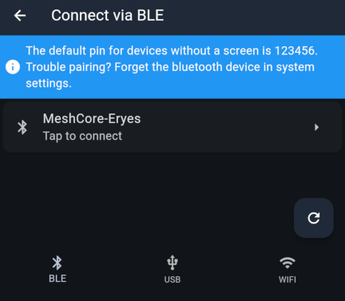
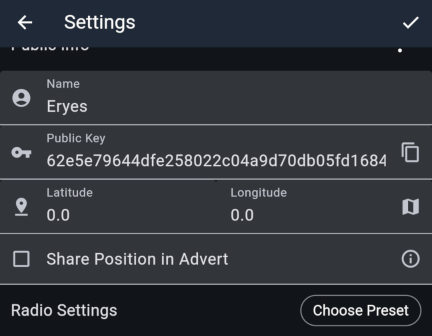
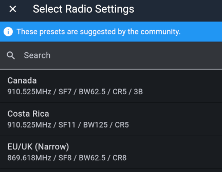
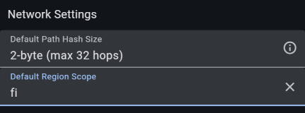
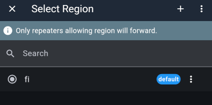

import DocLink from '@components/DocLink.astro';

## Suomen MeshCoren asetukset

Nämä ovat tärkeimmät asetukset. Ne on asetettava näin, jotta viestisi etenevät Suomen MeshCoressa.

| Asetus | Arvo | Merkitys |
|:-------|:----:|:---------|
| Radio Preset | EU/UK Narrow | Tämä valinta määrittää radion perusasetukset: taajuus ja LoRa-modulaatio. |
| Default Path Hash Size | 2-byte | Viestien välityksessä käytetään kahden tavun tarkkuutta, jotta sekaannusten riski vähenee. |
| Default Region Scope | fi | Kaikki viestit lähetetään Suomen kansallisella aluerajauksella, jos sitä ei kanavakohtaisesti muuteta. |

## Asetusten tekeminen askel askeleelta

Näissä ohjeissa käsitellään [virallisen MeshCore-sovelluksen](https://meshcore.io/#download) käyttöä. Sovellus toimii samalla tavalla sekä mobiililaitteilla että tietokoneella.

* Muodosta yhteys kumppaniradioon Connect-napista. Alapalkista valitaan yhteystapa Bluetoothin, USB-kaapelin ja WiFin välillä. Jos laitteessasi on näyttö, se kertoo Bluetoothin tunnuskoodin näytöllä; jos ei, käytössä on oletuskoodi 123456.

* Kun yhteys on muodostettu, pääset kumppaniradion asetuksiin hammasrataskuvakkeesta, joka ilmestyy samaan paikkaan kuin Connect-nappi.

* Anna asetuksissa kumppaniradiolle nimi. Tämä nimi näkyy keskusteluissa ja yksityisviesteissä omana nimenäsi. Julkinen avain on osoite, jota käytetään liikenteen ohjaamisessa. Sitä ei tarvitse muokata. Tämä ohje käsittelee tuonnempana julkisen avaimen käyttöä.

* Laitteen sijainnin voit asettaa koordinaatteina, jos kumppaniradiosi tulee vaikkapa kiinteästi kotiin asennetuksi. Kun sijainti on tiedossa, sovellus osaa kertoa välimatkat toistimiin ja muihin käyttäjiin. Laitteet, joissa on GPS-paikannus, löytävät paikkansa automaattisesti; toiminto täytyy laittaa päälle asetusten sivulta 'Position Settings'. Voit sallia sijaintisi jakamisen yleisesti 'Share Position in Advert' -ruksilla.

* Radioasetukset on MeshCore-sovelluksessa kerätty valmiiksi esiasetukseksi. Paina 'Choose Preset' ja valitse listalta 'EU/UK (Narrow)'. Radioasetuksia ei kannata muokata muuksi, koska tällöin viestisi eivät etene Suomen MeshCoressa. Samat radioasetukset pätevät koko Euroopan alueella MeshCoressa.

* Loput tärkeät asetukset löytyvät alempaa. Valitse 'Default Path Hash Size' → '2-byte'. Avaa 'Default Region Scope', lisää + -napista uusi arvo, kirjoita 'fi' ja kuittaa kuittausnapista. Valitse vielä listasta 'fi' niin, että se on valittuna kuvan kaltaisesti, ja poimi rivin päädyn valikosta 'Set Default'.

👍👍 Valmista tuli! Näillä säädöillä viestintä pelittää Suomen MeshCoressa. Seuraavissa osioissa käsitellään käytön kannalta tärkeät taidot. Jää siis vielä hetkeksi viisastumaan 😊

